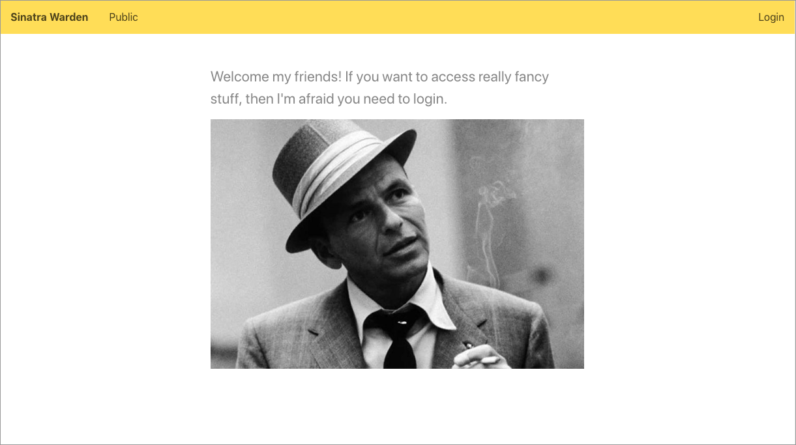

# Warden Sinatra example

An example of how to use Warden to create a username/password authentication in a Sinatra website. You can find the origin blog article here (in French) : 



## How shall I run the app?

I suppose you have a functionnal Ruby installation here.

```
$ bundle install
$ rake db:create
$ rake db:migrate
$ rake db:seed
$ ruby app.rb
```

And then you can try and login with user `admin` and password `admin` :)
